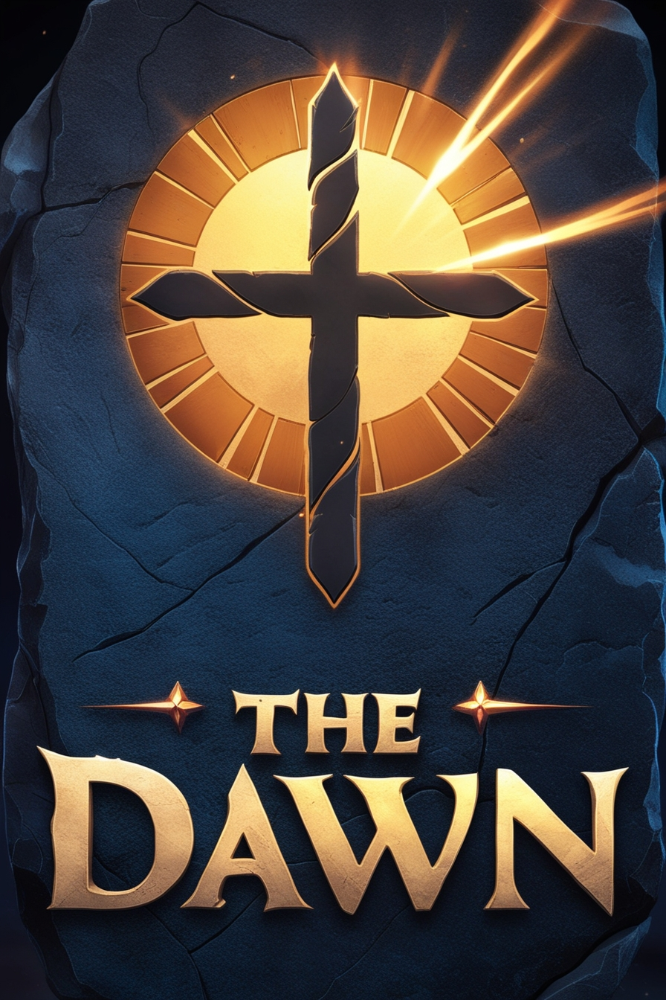

- **Logo :**  
  Le logo pourrait représenter un **soleil levant stylisé en rune nordique**, avec des **lignes tranchantes** et une **typographie angulaire**, comme gravée dans la pierre. Il pourrait être animé (par exemple, une lueur se propageant lentement sur les lettres), pour rappeler l’idée de l’aube qui se lève.

- **Palette de couleurs :**  
  Des tons **froids et sombres** (bleu nuit, gris acier, noir), contrastés par des touches **chaudes et éclatantes** (or, rouge écarlate, blanc lumineux) pour illustrer la lutte entre l’obscurité et la lumière.

- **Style graphique :**  
  Les environnements seront dessinés avec un **trait exagéré**, typique du manga, mais appliqué à des paysages nordiques : montagnes immenses, forêts aux arbres noueux, fjords nébuleux. Les personnages auront des **expressions marquées**, des **cheveux dynamiques**, et des **tenues mêlant armures historiques et éléments surnaturels** comme des capes magiques, des tatouages lumineux ou des armes brillantes.

- **Animation et effets visuels :**  
  Chaque attaque ou sort déclenchera des **effets visuels stylisés**, comme des coups de pinceau lumineux, des runes en surimpression, ou des ombrages accentués, pour renforcer la touche manga dans un monde viking.

# Prompt rentrée

"Créer un logo inspiré de l'ère Viking pour un jeu vidéo nommé 'The Dawn'. Le logo doit représenter un soleil levant stylisé derrière une rune nordique. Utiliser des lignes angulaires, nettes et gravées, donnant une sensation de pierre ancienne. Le soleil devrait émettre une lumière dorée et radieuse, avec des accents lumineux qui se propagent lentement sur la rune. La typographie du nom 'The Dawn' doit être bold, angulaire, gravée comme dans de la pierre, avec une aura mystique. Les couleurs dominantes doivent être froides et sombres (comme le bleu nuit, gris acier) contrastées par des touches chaudes et éclatantes (or, rouge écarlate). Le design doit mélanger l'héritage viking avec des éléments inspirés de l'animation, apportant une atmosphère mystique et épique."

