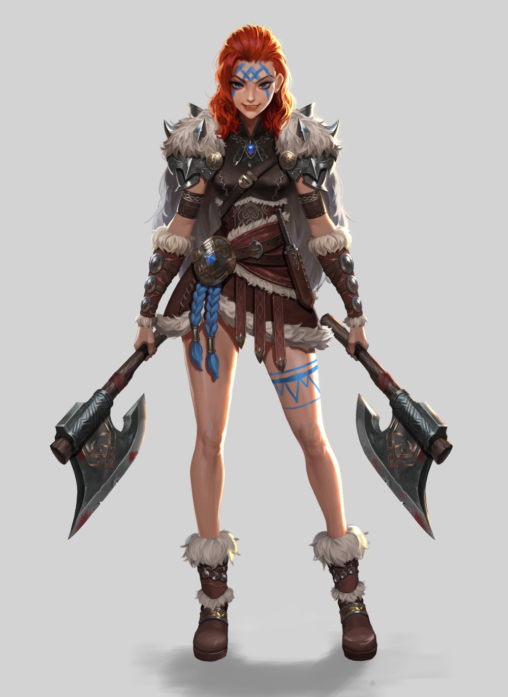

3. **génie artistique du concept**
   - Comment les personnages et les décors devraient-ils être conçus ?
   - Quels sont les éléments clés que doivent refléter les illustrations de concept ?

# Prompt rentrée

    En tant qu'illustrateur spécialisé en art manga, crée une image conceptuelle d'un personnage principal pour un jeu RPG se déroulant à l'époque viking. Le personnage est une guerrière avec une armure ornée de runes lumineuses, brandissant une épée enflammée, avec des cheveux longs flottant au vent, le tout dans un style manga avec des couleurs vives et des lignes audacieuses.

### Réponse par gpt-4o

Pour concevoir le personnage principal et les décors de votre jeu The Dawn, il est essentiel de fusionner l'esthétique viking traditionnelle avec des éléments inspirés du manga. Voici quelques directives pour orienter le développement artistique :​

Personnages :

Apparence : Le protagoniste, une guerrière viking, devrait arborer une armure ornée de runes lumineuses, combinant cuir, métal et fourrure pour refléter l'authenticité viking tout en intégrant des touches fantastiques. Ses cheveux longs et flottants, typiques du style manga, ajouteraient une dynamique visuelle.​

Armes : Une épée enflammée, aux détails complexes et aux effets lumineux, servirait d'arme principale, symbolisant la puissance et la magie.​

Expressions : Des expressions faciales exagérées, caractéristiques du manga, permettraient de transmettre efficacement les émotions du personnage.​

Décors :

Environnements : Des paysages nordiques stylisés, tels que des fjords majestueux, des forêts denses et des montagnes imposantes, rendus avec des lignes audacieuses et des couleurs vibrantes pour refléter l'influence manga.​

Ambiance : L'utilisation de conditions météorologiques dynamiques, comme des aurores boréales illuminant le ciel nocturne, renforcerait l'atmosphère mystique du jeu.​

Éléments clés pour les illustrations de concept :

Fusion des styles : Associer des motifs et symboles vikings avec des techniques artistiques manga pour créer une identité visuelle unique.​

Détails et textures : Porter une attention particulière aux textures des matériaux (métal, cuir, fourrure) et aux ornements runiques pour enrichir la profondeur visuelle.​

Palette de couleurs : Utiliser des teintes contrastées, mêlant des tons froids pour les environnements et des accents chauds pour les éléments magiques, afin de créer une ambiance immersive.​

En respectant ces directives, les illustrations de concept pour The Dawn captureront efficacement l'essence du jeu, offrant aux joueurs une expérience visuelle cohérente et envoûtante.

### Examples données par Chat-gpt-o4

