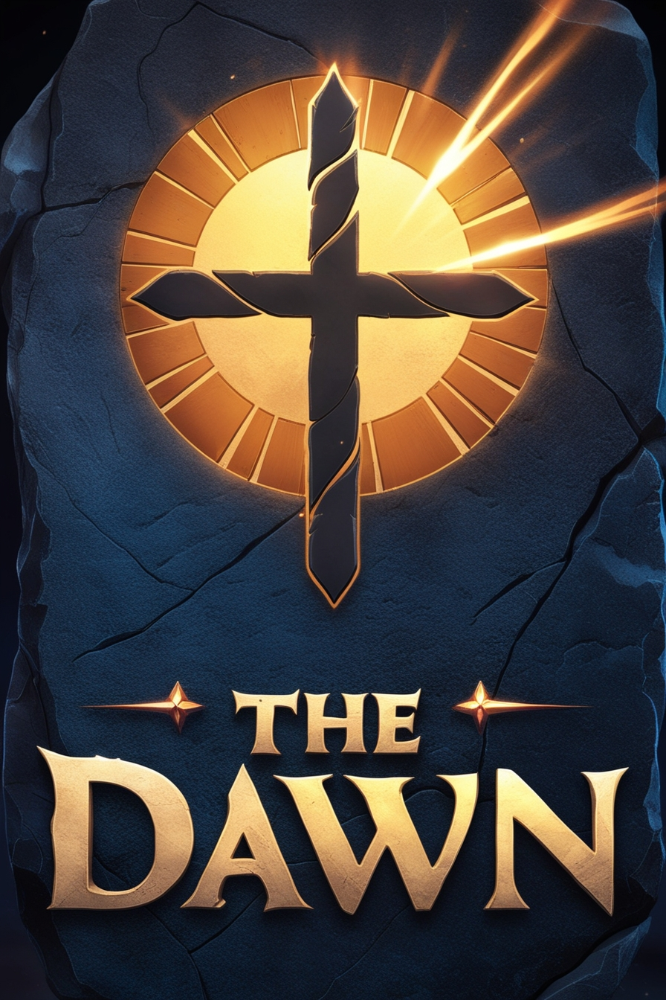
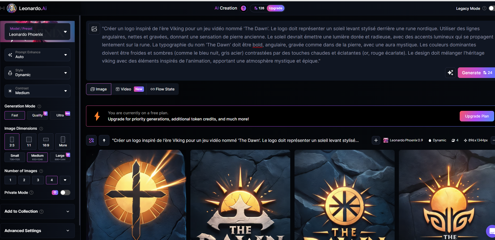
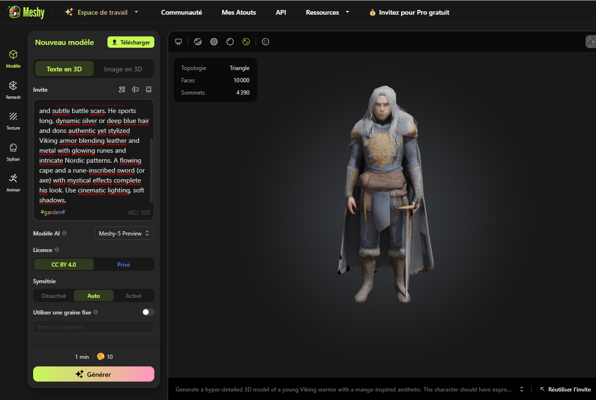

# Ragnarok: The Dawn

Mathieu Caulfuty, Hashem Hawarnah, Matys Raharison-Gouvet

## Sujet

Nous allons tout mettre en oeuvre pour créer un jeu video en utilisant des outils d'IA variés.
Nous choisirons nous meme le theme et l'histoire de notre jeu.

## 1. Brainstorming

Pour faire le brainstorming on commence pas l'idée suivante :

```
Je souhaite faire un jeu video en 3d de type rpg à l'époque des vikings avec un thème manga et artistique.
Un guerrier viking revient de la bataille et découvre que son clan est menacé par une ancienne malédiction. Accompagné d'un compagnon (peut-être un mystérieux étranger ou un animal maudit), il entreprend un voyage pour lever la malédiction et restaurer son honneur.
```

Prompt entré sur 'HuggingFace.co' :

```
Only English please. I want to create a 3D RPG video game set in the Viking era, incorporating a manga-inspired artistic style. The game should blend historical Viking themes with stylized anime aesthetics, featuring rich world-building, engaging combat mechanics, and deep character progression. I’d love ideas on the storyline, gameplay mechanics, art direction, and name for this game that can make this game stand out. What are some creative concepts to explore?
```

## 2. Identité

### Nom du jeu :

Le jeu s'appelle **The Dawn**, un titre court, percutant et symbolique. Il évoque à la fois un **nouveau départ** et une **lumière naissante** après une période sombre — un thème central du scénario, où le héros tente de briser une malédiction qui pèse sur son clan. Le mot "Dawn" (l’aube) fait aussi écho à la dualité entre ténèbres et lumière, très présente dans les récits épiques et les visuels manga.

### Identité visuelle :

L’identité visuelle du jeu mélange l’univers **brutal et mystique des vikings** avec des éléments **graphiques inspirés des mangas**.

Logo généré sur LeonardoIA :




## 3.genie artistique

=======
Voici une réponse détaillée pour répondre à ces deux questions en lien avec le concept de **The Dawn**.

---

### 1. Comment les personnages et les décors devraient-ils être conçus ?

**Personnages :**

- **Fusion du Style Historique et Manga :**  
  Les personnages doivent incarner l’esprit des Vikings tout en adoptant une esthétique manga. Cela signifie que leurs traits physiques (yeux expressifs, coiffures volumineuses, expressions faciales exagérées) doivent refléter le style japonais tout en conservant des attributs authentiques comme des vêtements et armures vikings.
- **Détails et Exagérations :**
  - **Traits Exagérés :** Utilisez des lignes dynamiques et des contours prononcés pour accentuer l’émotion et le mouvement (par exemple, des cheveux flottants ou des postures héroïques).
  - **Armures et Accessoires :** Intégrez des éléments traditionnels (casques, fourrures, cuir et métal martelé) rehaussés par des ornements fantastiques comme des runes lumineuses, des tatouages magiques ou des éclats de lumière sur les armes.
  - **Expression et Dynamisme :** Les personnages doivent transmettre leur personnalité à travers des poses et des expressions marquées – le héros, par exemple, pourrait afficher une détermination sans faille avec des yeux perçants et une posture qui reflète son endurance et sa bravoure.

**Décors :**

- **Environnements Nordiques Stylisés :**  
  Les décors doivent combiner la majesté des paysages vikings avec l’esthétique graphique du manga. Pensez à des fjords imposants, des montagnes enneigées, des forêts aux arbres noueux et des temples mystiques aux influences parfois japonaises, par exemple des sanctuaires inspirés des 神社.
- **Effets Dynamique et Ambiance Immersive :**
  - **Météo et Lumière :** Intégrez des conditions météorologiques variées (pluie, neige, orages) qui ne sont pas seulement un décor de fond, mais qui interagissent avec le gameplay et l'ambiance. Par exemple, un orage peut intensifier des attaques basées sur la foudre, ou la neige peut ajouter une couche de défi en termes de visibilité et de mouvement.
  - **Textures et Détails Artistiques :** Utilisez des textures qui suggèrent un rendu dessiné à la main (comme des coups de pinceau visibles) tout en conservant une touche moderne. Les décors doivent avoir des détails riches qui renforcent l'atmosphère mystique et ancienne, en utilisant des effets de lumière (aurores boréales, reflets sur l'eau) pour créer une ambiance à la fois réaliste et féerique.

---

### 2. Quels sont les éléments clés que doivent refléter les illustrations de concept ?

**Éléments Clés :**

- **Fusion des Thèmes Viking et Manga :**  
  Les illustrations doivent immédiatement évoquer cette double identité en intégrant des symboles et des motifs vikings (runnes, armes traditionnelles, paysages nordiques) aux techniques graphiques typiques du manga (traits exagérés, palettes de couleurs vives, effets de mouvement).

- **Contraste et Utilisation de la Lumière :**

  - **Palette de Couleurs :** Utilisez une combinaison de couleurs froides (bleu nuit, gris acier, noir) pour les environnements et des touches de couleurs chaudes et éclatantes (or, rouge, blanc lumineux) pour les éléments magiques et les points focaux (comme des runes scintillantes ou des éclairs d’énergie).
  - **Effets Visuels :** L'intégration d'effets dynamiques tels que des lueurs, des reflets et des particules est essentielle pour donner vie aux scènes et aux actions. Par exemple, une épée enflammée ou des runes sur une armure doivent ressortir grâce à des effets visuels audacieux.

- **Style et Texture :**

  - **Traits et Lignes :** Adoptez des lignes de contour fortes et un style de dessin rappelant les mangas, permettant ainsi de mettre en avant l’émotion et le dynamisme de chaque scène.
  - **Détails Rendus à la Main :** Les textures devraient donner une impression artisanale, comme si elles étaient créées à l’aide d’outils traditionnels, tout en intégrant un rendu 3D moderne. Cela permet de créer une ambiance unique et immersive qui capte l’attention du joueur.

- **Narration Visuelle :**  
  Chaque illustration de concept doit être conçue pour raconter une partie de l'histoire du jeu. Que ce soit à travers la posture d’un personnage, l’atmosphère d’un décor ou des détails subtils dans les accessoires, les visuels doivent inciter le spectateur à ressentir le conflit entre l'obscurité de la malédiction et l’espoir symbolisé par "The Dawn".

---


---


En résumé, les personnages doivent être conçus comme des figures dynamiques mêlant l’authenticité viking et la stylisation manga, tandis que les décors doivent évoquer des environnements nordiques grandioses renforcés par des effets de lumière et des textures artistiques. Les illustrations de concept doivent, quant à elles, capturer l’essence de cette fusion en mettant en avant des éléments visuels qui racontent l'histoire et renforcent la dualité entre la tradition et la modernité.

## 4. Scénario et narration

**The Dawn** suit **Eirik**, un guerrier viking qui revient chez lui pour découvrir que son clan est frappé par une malédiction ancienne, plongeant son village dans une nuit éternelle. Accompagné de **Astrid**, une mystérieuse guide dotée de pouvoirs mystiques, il entreprend un voyage pour briser la malédiction. À travers des terres hantées et des temples oubliés, Eirik découvre que la malédiction est liée à des rituels anciens réalisés par ses ancêtres. Il devra faire face à des choix difficiles entre vengeance, honneur et sacrifice, tandis que ses décisions affectent le destin de son clan. Les personnages principaux incluent Eirik, Astrid, le chef Bjorn, la Valkyrie Hildegarde, et le Gardien des Runes, qui jouent tous un rôle clé dans la quête de rédemption.

## 5. Musique et bande son

### Bande-Son du Jeu "Ragnarok: The Dawn"

Les morceaux suivants ont été créés à l'aide des prompts de génération musicale adaptés pour "Ragnarok: The Dawn". Ils illustrent l'atmosphère épique et mystique du jeu en fusionnant des éléments orchestraux, traditionnels nordiques et modernes :

- **1.mp3**  
  _Prompt utilisé :_  
  "Créer une bande-son immersive pour 'Ragnarok: The Dawn', un jeu d’action-aventure se déroulant à l’ère viking. La musique doit fusionner des cordes dramatiques, des chœurs épiques, des percussions tribales et des touches électroniques, évoquant une quête mystique et épique. Utiliser des éléments sonores traditionnels nordiques et des textures modernes pour accentuer la tension, l’exploration et l'intensité des combats."

- **musique2.mp3**  
  _Prompt utilisé :_  
  (Instrumental Viking soundtrack: hard-hitting orchestral swells, fierce percussion, and booming bass. Pure, relentless battle energy—no vocals, just raw, epic power.)

Ces fichiers illustrent l'évolution de la bande-son du jeu – depuis des ambiances immersives et mystérieuses jusqu'aux séquences d'action et de bataille intenses.
[Listen to musique1.mp3](5.musique%20et%20son/1.mp3)
[Listen to musique1.mp3](5.musique%20et%20son/2.mp3)


## 6. Modélisation 3D

### Comment les personnages et les objets devraient-ils être modelés en 3D ?
La modélisation 3D dans **The Dawn** devrait suivre une approche hybride, alliant le réalisme des éléments vikings à l'esthétique manga. Les personnages, comme **Eirik** et **Astrid**, devraient avoir des proportions légèrement exagérées pour capturer le style manga tout en conservant une apparence réaliste. **Eirik**, par exemple, pourrait avoir des traits marqués, avec une musculature prononcée et des détails comme des tatouages runiques sur ses bras et des cicatrices de guerre. **Astrid**, en revanche, pourrait avoir un design plus fluide et éthéré, avec des cheveux longs et ondulés, des yeux captivants et des vêtements qui semblent presque surnaturels.

Les personnages doivent également être animés de manière fluide et dynamique, en particulier lors des scènes de combat. Les mouvements doivent être impressionnants et amples pour accentuer l’aspect héroïque des personnages. Les armures doivent être détaillées et fonctionnelles, mais aussi incorporer des éléments mystiques et fantastiques, tels que des runes incisées dans le métal, des effets lumineux ou des textures d’énergie magique, pour renforcer l'aspect magique et légendaire du jeu.

Les **objets** (armes, boucliers, artefacts magiques) devraient être soigneusement modélisés pour refléter la culture viking, tout en intégrant des éléments fantastiques. Par exemple, les **épées** peuvent être ornées de motifs vikings, tandis que les **boucliers** pourraient avoir des motifs lumineux ou des effets visuels associés à la magie ancienne. Les **temples et ruines** doivent avoir des détails architecturaux réalistes, avec des pierres et des éléments de la nature qui se mélangent à l’aspect mystique du monde, comme des racines d'arbres massives ou des symboles runiques flottants.

### Quels détails sont importants pour refléter le thème visuel ?
Pour que le jeu reflète bien le thème viking et manga, plusieurs éléments clés doivent être pris en compte dans la modélisation 3D :
1. **Textures réalistes et mystiques** : Les matériaux naturels comme le bois, la pierre et le métal doivent être représentés de manière réaliste, mais avec des touches surnaturelles comme des runes incisées ou des éclats de lumière pour renforcer l’aspect magique.
2. **Effets de lumière** : L'éclairage dynamique est essentiel, notamment pour les scènes en extérieur avec des conditions météorologiques changeantes. Par exemple, des éclats de lumière peuvent être ajoutés autour des **runes** ou des **artéfacts** magiques, tandis que les scènes en intérieur, comme les temples, doivent bénéficier de jeux d'ombre et de lumière mystérieux.
3. **Vêtements et armures** : Les armures doivent être fidèles aux styles vikings, mais intégrant des éléments de conception inspirés de l'anime, comme des tissus flottants, des éléments translucides ou des accessoires fantaisistes.
4. **Créatures mythologiques** : Les créatures comme les trolls ou les Valkyries devraient être impressionnantes et détaillées, avec des textures de peau qui combinent un réalisme brut (peau de troll, plumes de Valkyrie) et des touches fantastiques, comme des auras lumineuses ou des yeux brillants.
5. **Paysages** : Le monde du jeu doit être richement détaillé, avec des montagnes majestueuses, des forêts épaisses, des fjords gelés et des temples anciens. La végétation et la faune devraient avoir une apparence naturelle et détaillée, mais aussi intégrer des éléments surnaturels, comme des racines lumineuses ou des pierres flottantes, pour renforcer l'atmosphère mystique du jeu.




## 7. Animation et Locomotion

### Comment les personnages devraient-ils se déplacer et interagir dans le monde du jeu ?
Les déplacements des personnages dans **The Dawn** doivent allier fluidité et intensité pour correspondre à l'univers à la fois épique et surnaturel du jeu. Voici quelques éléments clés à considérer :

1. **Déplacements Dynamiques :**  
   Les personnages, qu'ils soient en combat ou en exploration, doivent avoir des animations de déplacement naturelles et dynamiques. Les déplacements en course devraient être puissants et imposants, avec des mouvements qui reflètent la robustesse des vikings. Lors des déplacements en terrain difficile (comme des montagnes enneigées ou des forêts denses), des animations supplémentaires montrant des ajustements de posture ou de prise d'appui sur les surfaces instables renforceront le réalisme.

2. **Interactivité avec l'Environnement :**  
   Les personnages doivent pouvoir interagir de manière fluide avec l'environnement. Cela inclut des animations pour escalader des murs, sauter par-dessus des obstacles, se faufiler à travers des espaces étroits, et couper des arbres ou des buissons. Les interactions avec des éléments mystiques, comme activer des runes ou manipuler des objets magiques, doivent être accompagnées de gestes spécifiques, comme des gestes de la main ou des postures rituelles.

3. **Combat :**  
   Lors des combats, les mouvements doivent être amples et impressionnants. Les attaques doivent avoir un impact visuel fort, avec des animations fluides et des transitions rapides entre les différentes positions (attaque, défense, esquive). Des animations de compétence spéciales (comme l’invocation de runes ou de créatures spirituelles) doivent être visuellement spectaculaires et uniques.

### Quels types d'animation sont essentiels pour une expérience immersive ?
Pour offrir une expérience immersive, les animations suivantes sont essentielles :

1. **Animations de Combat :**  
   - **Attaques de mêlée et à distance** : Les coups de hache, d'épée ou d'arc doivent être animés de façon fluide et percutante, avec des effets visuels dynamiques comme des éclats de lumière, des étincelles ou des runes activées au moment de l'impact.
   - **Esquives et parades** : Les personnages doivent pouvoir esquiver ou parer avec des animations qui mettent en valeur leur agilité et leur habileté au combat.
   
2. **Animations de Magie et d'Invocation :**  
   - Les gestes pour invoquer des créatures mystiques ou activer des runes doivent être accompagnés d'animations spécifiques, telles que des gestes précis de la main ou des postures de méditation.
   - L’activation de pouvoirs ou de runes devrait être marquée par des animations de lumière, de particules et des effets spéciaux, créant ainsi une ambiance mystique.

3. **Animations de Locomotion :**  
   - **Course et marche :** Les déplacements de base (course, marche) doivent paraître naturels, mais puissants, surtout dans des terrains difficiles comme la neige ou les forêts.
   - **Interactivité environnementale :** Lorsque le personnage interagit avec des éléments (escalader, grimper), les animations doivent être fluides et crédibles.

4. **Expressions Faciales et Gestes :**  
   Les personnages doivent avoir des expressions faciales marquées qui reflètent leurs émotions en fonction des situations : colère, détermination, peur ou triomphe. Les gestes de la main pour les interactions magiques, ou même lors des conversations, devraient ajouter une dimension supplémentaire à l’immersion.

5. **Réactions au Terrain et aux Conditions Météorologiques :**  
   - **Réactions à la neige, au vent et à la pluie :** Les personnages devraient réagir aux conditions météorologiques, avec des animations qui montrent, par exemple, un personnage luttant contre le vent en traversant une tempête de neige, ou réagissant au froid en resserrant son manteau.

En combinant ces éléments d'animation et de locomotion, **The Dawn** offrira une expérience de jeu riche, fluide et immersive, où chaque mouvement du personnage reflète l’intensité et le mysticisme de l’univers viking.

## 8. Assemblage des Ressources

### Comment assembler et organiser toutes les ressources générées pour créer une identité cohérente ?
Pour créer une identité cohérente dans **The Dawn**, l’assemblage et l'organisation des ressources doivent suivre une approche systématique et structurée. Voici les étapes principales à suivre :

1. **Création d’un Style Visuel Unifié :**
   - **Palette de Couleurs et Textures :** Définir une palette de couleurs dominantes (tons froids pour les paysages nordiques, touches lumineuses pour les éléments magiques) et des textures spécifiques (par exemple, des rendus de bois, métal et fourrure pour les personnages et les décors vikings).
   - **Guide de Style Graphique :** Créer un guide détaillant les éléments visuels (personnages, environnement, objets), leur style de dessin (réaliste vs. stylisé), les éléments de design (formes, textures) et les effets spéciaux (lumières, particules, magie). Ce guide assurera la cohérence visuelle tout au long du développement.

2. **Organisation des Ressources 3D et Textures :**
   - **Organisation des Modèles 3D :** Regrouper tous les modèles de personnages, créatures, objets et décors par catégorie (personnages principaux, ennemis, environnement, accessoires, armes, etc.). Chaque modèle doit avoir un nom descriptif et une version numérotée pour faciliter les mises à jour.
   - **Textures et Matériaux :** Organiser les textures et matériaux par type (textures de terrain, de peau, de métal, de runes magiques, etc.). Assurer une nomenclature claire pour les fichiers (par exemple, “texture_terrain_fjord_v01” ou “arme_légendaire_runique_tex01”).

3. **Effets Visuels et Animations :**
   - **Effets de Magie et Climat :** Tous les effets visuels (par exemple, effets de lumière, éclats de magie, orages, neige, etc.) doivent être stockés et classés par type, avec des spécifications précises pour leur utilisation (intensité, fréquence, durée).
   - **Animations :** Organiser les animations des personnages et créatures en sous-catégories (animations de combat, déplacements, interactions avec l’environnement, etc.), en utilisant un système de nommage clair qui reflète l’action de l’animation (ex. : "attaque_hache_v01", "esquive_arbalète_v02").

4. **Son et Musique :**
   - **Ambiance sonore et effets spéciaux :** Organiser les fichiers audio selon les types (bruits de fond, sons d'attaque, bruits environnementaux comme le vent, la neige qui tombe, etc.). 
   - **Musique et Sons Magiques :** Créer des sous-dossiers pour les pistes musicales (par exemple, thème de combat, thème mystique) et les effets sonores liés à la magie (sons de runes, invocation de créatures spirituelles).

5. **Intégration et Tests :**
   - **Prototypage et Tests :** Lorsque les ressources sont assemblées, les intégrer d'abord dans des prototypes pour tester leur interaction dans l'environnement de jeu. Cela permettra de vérifier la fluidité des animations, la cohérence des effets visuels et la bonne intégration des textures.

### Quelles informations sont nécessaires pour la documentation du projet ?
Une documentation complète et détaillée est essentielle pour garder une vue d’ensemble sur le projet et assurer la cohérence tout au long du développement. Voici les informations nécessaires pour la documentation du projet :

1. **Vue d'ensemble du Projet :**
   - **Contexte Narratif et Concept du Jeu :** Un résumé de l’histoire, des personnages principaux et des objectifs du jeu.
   - **Public Cible et Objectifs :** Définir le public visé (joueurs de RPG, fans de culture viking et de style manga) et les objectifs du jeu (immersif, interactif, avec des éléments de magie et de combat stratégique).

2. **Guide Visuel et Art Direction :**
   - **Style Graphique et Concept Art :** Présenter les concepts visuels des personnages, des environnements, et des objets clés, ainsi qu'un guide sur la direction artistique et le style choisi (manga avec éléments vikings).
   - **Palette de Couleurs et Design des Interfaces :** Spécifications de la palette de couleurs utilisée pour chaque type d’environnement, personnage, et effet. Définir le style des menus, de l’HUD et des interfaces.

3. **Détails Techniques :**
   - **Formats de Fichiers et Nommage :** Spécifier les formats de fichiers pour chaque type de ressource (modèles 3D, textures, animations, effets sonores, etc.), ainsi que la convention de nommage pour faciliter l’organisation et la mise à jour des fichiers.
   - **Optimisation et Performances :** Détails sur l’optimisation des modèles, des textures et des animations pour garantir une expérience fluide sur toutes les plateformes.

4. **Planification et Calendrier de Production :**
   - **Calendrier des Étapes de Développement :** Un calendrier détaillant les étapes clés du développement (conception des personnages, des décors, animations, tests, etc.).
   - **Répartition des Tâches :** Attribution des rôles et des responsabilités pour chaque membre de l’équipe (artistes, designers, programmeurs).

5. **Tests et Feedback :**
   - **Critères de Validation :** Définir des critères pour tester l’intégration des ressources dans le jeu (vérification de la fluidité des animations, cohérence des textures, impact des effets visuels sur le gameplay).
   - **Retour des Tests Joueurs :** Méthodologie pour recueillir les retours des testeurs et ajuster les éléments visuels ou techniques en fonction de leurs remarques.

En structurant et organisant les ressources ainsi que la documentation, l’équipe de développement pourra travailler de manière plus fluide et cohérente, en garantissant que le jeu maintienne une identité visuelle et technique forte tout au long de sa création.


## Conclusion

Pour **The Dawn**, une approche technologique moderne et innovante a été adoptée pour garantir une expérience de jeu immersive et cohérente. Voici un récapitulatif des principales technologies utilisées dans la création du projet :

1. **ChatGPT et HuggingChat** : Ces outils ont été utilisés pour générer des dialogues interactifs, des scripts narratifs et pour aider à la structuration des éléments du jeu. Ils ont également facilité la création de textes dynamiques et la rédaction de descriptions détaillées des personnages, de l'univers, et de l'intrigue.

2. **LeonardoIA** : Utilisé pour la création d'illustrations conceptuelles et le design de personnages, d'environnements et d'objets. LeonardoIA a permis de fusionner efficacement l'esthétique manga avec des éléments historiques vikings, offrant ainsi une direction artistique unique et un style visuel cohérent pour le jeu.

3. **Meshy** : Utilisé pour la modélisation 3D et l'animation des personnages, créatures et environnements du jeu. Meshy a simplifié l'assemblage des ressources et permis la création de modèles détaillés et optimisés, adaptés aux exigences du gameplay tout en respectant le style visuel défini.

Ces technologies ont permis une synergie créative entre l’intelligence artificielle et les outils de modélisation, garantissant un développement fluide, rapide et cohérent tout au long de la production de **The Dawn**. Grâce à cette approche technologique, le projet bénéficie d’une structure solide et d’un gameplay captivant, tout en s’assurant que chaque élément visuel, sonore et narratif s’intègre parfaitement dans l'univers du jeu.


<h1>Merci pour votre lecture</h1>
